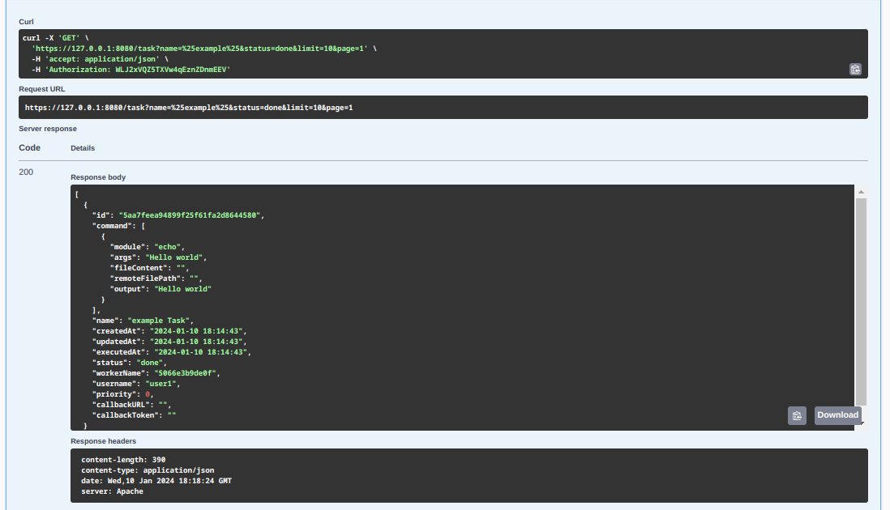

<p align="center">
  
</p>

<p align="center">
   <a href="https://github.com/r4ulcl/nTask/releases">
    
  </a>
  <a href="https://github.com/r4ulcl/nTask/stargazers">
    
  </a>
  <a href="https://github.com/r4ulcl/nTask/network">
    
  </a>
  <a href="https://github.com/r4ulcl/nTask/issues">
    
  </a>
  <a href="https://www.codefactor.io/repository/github/r4ulcl/nTask">
    
  </a>
    <a href="https://github.com/r4ulcl/nTask">
    
  </a>
  <a href="https://github.com/r4ulcl/nTask/blob/main/LICENSE">
    
  </a>

  <br>
  <a href="https://hub.docker.com/r/r4ulcl/nTask">
    
  </a>
    <a href="https://hub.docker.com/r/r4ulcl/nTask/tags">
    
  </a>
  
  </p>

# nTask

nTask is a distributed task management program that allows you to distribute tasks, commands, or programs across multiple computers. It utilizes API communications and WebSockets to facilitate seamless communication between the manager and workers. The program consists of a manager component that handles task requests from clients and distributes them to available workers. The workers execute the tasks and send the execution results back to the manager, which then stores the results in a database. Additionally, the results can be sent to a specified URL/API for further processing.

You can connect another API, Telegram bot ot a simple bash script to the manager API to process tasks. To test and see how to make API requests you can use the swagger flag to access the web server with the documentation:

<p align="center">
  
</p>

## Features

- **API-based Task Management**: nTask provides an API that allows users to manage tasks, enabling integration with other systems and services.

- **WebSockets**: The manager and workers establish communication channels using WebSockets, ensuring real-time and efficient task distribution.

- **Scalability**: nTask supports multiple workers, allowing parallel execution of tasks across a distributed network.

- **Database Integration**: The program utilizes a MySQL database to store task information, ensuring data persistence and easy retrieval.

- **Configuration Flexibility**: Task modules can be easily configured using a JSON file, providing flexibility in defining task behavior.

- **Secure Task Execution**: Each worker can authenticate using a unique token, ensuring secure task execution.

- **Parallel Task Execution**: Each worker can be configured to execute a configurable number of tasks simultaneously, improving overall performance.

- **File Support**: nTask supports sending files as part of a task and allows users to specify a custom path for saving the files.

- **Secure Communication**: TLS support enables secure communication between the manager and workers, with certificate verification for added security.

- **Optional SSH Tunneling**: nTask provides the option to use SSH tunneling to securely send the manager API port to clients without exposing it.

- **Multi-Platform Support**: nTask is compatible with both Linux and Windows operating systems, ensuring broad platform compatibility.

- **Docker Support**: The program is Docker and Docker Compose ready, simplifying deployment and management.

- **OAuth Support**: Multiple users can be managed in the manager using OAuth tokens, enhancing security and access control.

- **Dynamic IP Compatibility**: nTask is compatible with dynamic IPs, both for workers and the manager (when using SSH tunneling).

- **Callback Option**: Users can configure callback options for task execution, enabling further processing or notifications.

- **Logging**: Output logging to file is supported, facilitating easy tracking and analysis of task execution.

- **Documentation and Web Interface**: nTask provides Swagger documentation for easy integration and interaction with the API, along with an optional web interface for a more user-friendly experience.

## Installation

### Docker

Both images use the same binary, but the manager uses a scratch image just to run the binary and the worker uses a kali-linux image to install tools and dependencies easier. 

You can pull these images from Docker Hub:

``` bash
docker pull r4ulcl/nTask-manager
docker pull r4ulcl/nTask-worker
```

### Manual Installation

To install nTask manually, you need to have Go installed on your machine. You can download and install Go from the official website: [https://golang.org](https://golang.org).

Once Go is installed, you can clone the repository and build the manager:

```bash
go install github.com/r4ulcl/nTask
```

Or, you can clone the repository and build the manager using the following commands:

```bash
git clone https://github.com/r4ulcl/nTask.git
cd nTask
go build
```

## Configuration Manager

### SSL (optional)

You can use any certificate for the manager and the worker. If you want to use a self signed certificate you can execute the following code, by default the manager and workers only check the certificate, not the IP or domain. If you want to check fully the certificate edit the script with the correct fields and use the flag `-verifyAltName`.

``` bash
bash generateCert.sh
```

Set the certificate folder in the `certFolder` variable in the `manager.conf` config file. 

### nTask manager

The manager requires a configuration file named `manager.conf` to be present in the same directory as the executable. The configuration file should be in JSON format and contain the following fields:

  ```json
  {
  "users": {
    "user1": "WLJ2xVQZ5TXVw4qEznZDnmEEV",
    "user2": "WLJ2xVQZ5TXVw4qEznZDnmEE2",
    "user3": "WLJ2xVQZ5TXVw4qEznZDnmEE3"
  },
  "workers": {
      "workers": "IeH0vpYFz2Yol6RdLvYZz62TFMv5FF"
  },
  "statusCheckSeconds": 10,
  "StatusCheckDown": 360,
  "port": "8080",
  "dbUsername": "your_username",
  "dbPassword": "your_password",
  "dbHost": "db",
  "dbPort": "3306",
  "dbDatabase": "manager",
  "diskPath": "",
  "certFolder": "./certs/manager/"
}
```

- `users`: A map of user names and their corresponding OAuth tokens for authentication.
- `workers`: A map of worker names and their corresponding tokens for authentication. (In this case all workers use the same token called workers)
- `statusCheckSeconds`: The interval in seconds between status check requests from the manager to the workers.
- `StatusCheckDown`: The number of seconds after which a worker is marked as down if the status check request fails.
- `port`: The port on which the manager should listen for incoming connections.
- `dbUsername`: The username for the database connection.
- `dbPassword`: The password for the database connection.
- `dbHost`: The hostname of the database server.
- `dbPort`: The port number of the database server.
- `dbDatabase`: The name of the database to use.
- `diskPath`: (optional) The folder path where task outputs should be saved.
- `certFolder`: The folder path where SSL certificates for the manager should be stored.

## Configuration Worker

The worker requires a configuration file named `workerouter.conf` to be present in the same directory as the executable. The configuration file should be in JSON format and contain the following fields:

```json
{
  "name": "",
  "iddleThreads": 2,
  "managerIP": "127.0.0.1",
  "managerPort": "8080",
  "managerOauthToken": "IeH0vpYFz2Yol6RdLvYZz62TFMv5FF",
  "CA": "./certs/ca-cert.pem",
  "insecureModules": true,
  "modules": {
    "sleep": "/usr/bin/sleep",
    "curl": "/usr/bin/curl",
    "echo": "/usr/bin/echo",
    "cat": "/usr/bin/cat",
    "grep": "/usr/bin/grep",
    "nmap": "nmap",
    "nmapIPs": "bash ./worker/modules/nmapIPs.sh",
    "exec": ""
  }
}
```

- `name`: (optional) The name of the worker. If not provided, the hostname will be used.
- `iddleThreads`: The number of idle threads in the worker (default: 5).
- `managerIP`: The IP address or domain name of the manager.
- `managerPort`: The port on which the manager is listening.
- `managerOauthToken`: The OAuth token for authentication with the manager.
- `port`: The port number on which the worker should listen for incoming requests.
- `CA`: The path to the CA certificate used for TLS communication with the manager.
- `insecureModules`: This flag determines whether the worker allows the execution of insecure modules with special characters like `;` or `|`.
- `modules`: A map of module names to executable commands.

Note: The `exec` module and the `insecureModules` flag allow remote execution of arbitrary commands on the worker. Use them with caution.
   
Each worker uses a unique name and IP:port combination to identify itself to the manager. If the name is left blank and the IP and port are different for each client, the same VPS can be cloned indefinitely as long as each VPS has a different hostname.

## Usage manager

An usage example can be found here: https://r4ulcl.com/posts

I recommend the following configuration:
- Manager:
  - Execute the manager in a docker compose in the manager sever.
- Worker:
  - Create a new Dockerfile installing the needed tools in the docker for the workers.
  - Create a VPS, install all the tools and nTask and execute it there.
  - If you want to execute external tools in docker you cant share the docker.sock with this docker and execute any docker from the nTask docker. 

### Manager flags 

  - `-c`, `--configFile` string      Path to the config file (default: manager.conf)
  - `-f`, `--configSSHFile` string   Path to the config SSH file (default empty)
  - `-s`, `--swagger`: Enables the Swagger endpoint (/swagger) to access API documentation and interact with the API using its UI.


### Docker compose

Once the configuration files have been modified. To run nTask in manager mode the easiest way is to run the docker compose manager as follows. 

``` bash
docker compose up manager -d
```

### Binary 

To start the manager, run the executable:

``` bash
$ ./nTask manager
```

The manager will read the configuration file, connect to the database, and start listening for incoming connections on the specified port.

## Usage worker

The best way to deploy workers is to close a base image and duplicate it as needed. The easiest option to modify later is to install nTask and the tools directly on the VPS. 

### Worker flags 

  - `-c`, `--configFile` string      Path to the config file (default: worker.conf)

### Docker compose

Once the manager is up, we can run the following docker compose on each worker instance

``` bash
docker compose up worker -d
```

### Binary 

``` bash
$ ./nTask worker
```

### Custom Dockerfile

Edit the `./worker/Dockerfile` file adding the needed tools for the modules. You can also modify the docker image, the default one is Kali. 

## Usage API

To use the API, you can access the Swagger web interface by using the `--swagger` flag on the manager. This allows you to manually perform queries and interact with the API.

### Status Endpoint
The `Status` endpoint provides general information about the nTask status. This includes the number of pending, running, completed, and deleted tasks, as well as the number of workers that are up and down.

To retrieve the status, you can use the following `curl` command:

``` bash
curl -X 'GET' \
  'https://$IP:$PORT/status' \
  -H 'accept: application/json' \
  -H 'Authorization: $AUTH'
```

<p align="center">
  
</p>


### Add Task Endpoint
To add a task, you need to make a POST request to the `/task` endpoint. The request should include the necessary fields, such as the command, name, and priority.

Here is an example `curl` command for adding a task:

``` bash
curl -X 'POST' \
  'https://$IP:$PORT/task' \
  -H 'accept: application/json' \
  -H 'Authorization: $AUTH' \
  -H 'Content-Type: application/json' \
  -d '{
  "command": [
    {
      "args": "Hello world",
      "module": "echo"
    }
  ],
  "name": "example Task",
  "priority": 0
}'
```

You should receive a response confirming that the task has been successfully added.

<p align="center">
  
</p>

### Get Tasks Endpoint
To retrieve a list of tasks based on certain criteria, you can use the `Get Tasks` endpoint. The endpoint allows you to filter tasks by name, status, and limit the number of results.

Here is an example `curl` command for retrieving tasks filtering any tasks which contains `example` and status is `done`:

```bash
curl -X 'GET' \
  'https://$IP:$PORT/task?name=%25example%25&status=done&limit=10' \
  -H 'accept: application/json' \
  -H 'Authorization: $AUTH'
```

You will receive a response containing the tasks that match the specified criteria.

<p align="center">
  
</p>

## Secure

To ensure the security of the nTask Manager, we recommend implementing the following measures:
- Use a legitimate TLS certificate to secure communication between the manager and the workers.
- Change the default port to a high port.
- Filter with `iptables` the input to allow only the IPs of the workers.
- Create an SSH tunnel to prevent the API port from being exposed on the internet.

### Use SSH tunnels

Using SSH tunnels is a recommended method to enhance the security of the nTask Manager. By configuring SSH tunnels, the manager can send the port to each worker without exposing the API to the internet.

#### SSH config file

To connect a SSH server automatcally from nTask you need a private certificate with access to the server and to confiure a configSSHFile:

``` bash
{
  "ipPort": {
    "<IP1>" : "22",
    "<IP2>" : "22",
    "<IP3>" : "22"
  },
  "username": "root",
  "privateKeyPath": "~/.ssh/ssh_key",
  "privateKeyPassword": ""
}
```

- `ipPort`: List of ip and port combination to connect to with SSH. 
- `username`: User to access via SSH.
- `privateKeyPath`: Path to the SSH private key.
- `privateKeyPassword`: (Optional) Password for the private key.

#### Manually

Alternatively, you can establish an SSH tunnel manually by following these steps:

```bash
ssh -L local_port:remote_server:remote_port -R remote_port:localhost:local_port user@remote_server
```

 Replace `local_port` with the port number on the manager machine, `remote_server` with the IP address or hostname of the worker machine, `remote_port` with the port number on the worker machine, and `user` with the SSH user.

   This command establishes a tunnel between the manager and the worker, allowing secure communication without exposing the API to the internet.

## Global flags

The nTask Manager supports the following global flags:

- `-v`, `--verbose`: Sets the manager/worker in verbose mode, providing additional logging.
- `-d`, `--debug`: Sets the manager/worker in debug mode, providing additional logging and diagnostics information.
  - `-h`, `--help`: Help for the GUI usage. 

## API Endpoints

The nTask Manager exposes the following API endpoints:

### Manager Endpoints

- `GET /task`: Retrieves information about all tasks.
- `POST /task`: Adds a new task.
- `DELETE /task/{ID}`: Deletes a task with the specified ID.
- `GET /task/{ID}`: Retrieves the status of a task with the specified ID.

### Worker Endpoints

- `GET /worker`: Retrieves information about all workers.
- `POST /worker`: Adds a new worker.
- `DELETE /worker/{NAME}`: Deletes a worker with the specified name.
- `GET /worker/{NAME}`: Retrieves the status of a worker with the specified name.

You can access these API endpoints using a REST client such as cURL or Postman.

## Swagger Documentation

The nTask Manager provides Swagger documentation for its API, which allows for easier understanding and testing of the available endpoints.

### Generating Swagger docs

To generate the Swagger documentation, follow these steps:

1. Install the latest version of the `swag` command-line tool by running the following command:

   ``` bash
   go install github.com/swaggo/swag/cmd/swag@latest
   ```

2. Initialize the Swagger docs by running the following command:

   ``` bash
   swag init
   ```

   This command generates the Swagger JSON and the necessary files for the Swagger UI.
   
## Diagram


The diagram above illustrates the architecture of the nTask Manager and its interactions with the workers.

## TODO
- Code tests
- DigitalOcean API
  - Get list of droplets to SSH connect
  - Dinamic number of droplets between min and max
- Optimize small tasks

## Author

- [Raúl Calvo Laorden (@r4ulcl)](https://r4ulcl.com/)

## Support this project

### Buymeacoffee

[](https://www.buymeacoffee.com/r4ulcl)

## License

[GNU General Public License v3.0](https://github.com/r4ulcl/nTask/blob/master/LICENSE)
